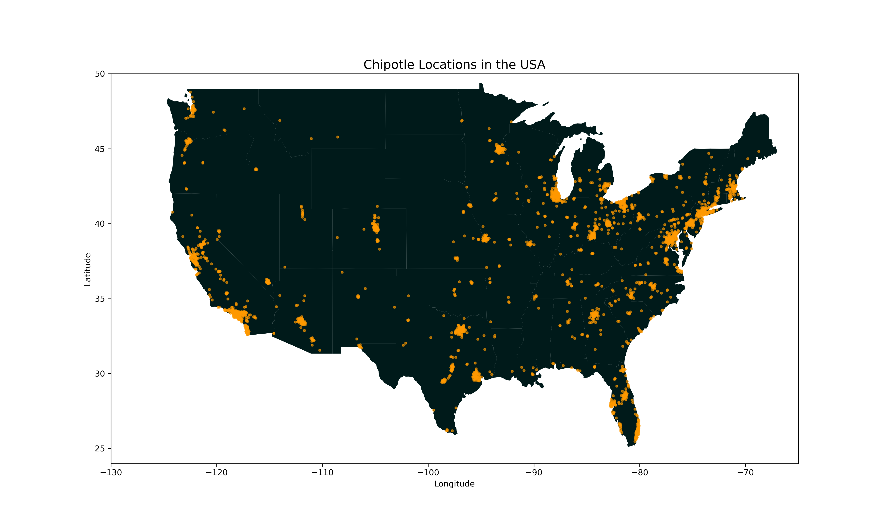
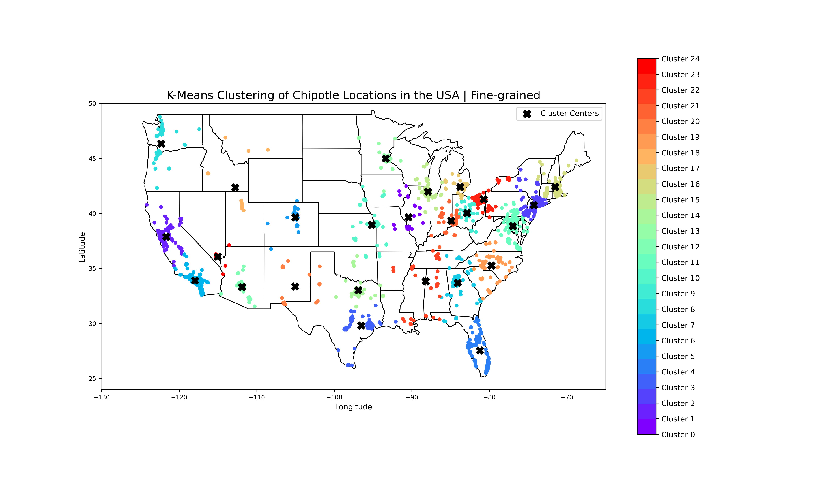
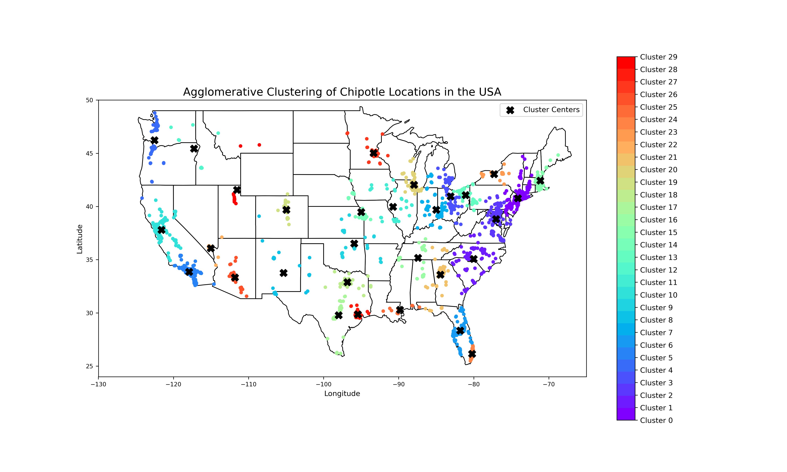
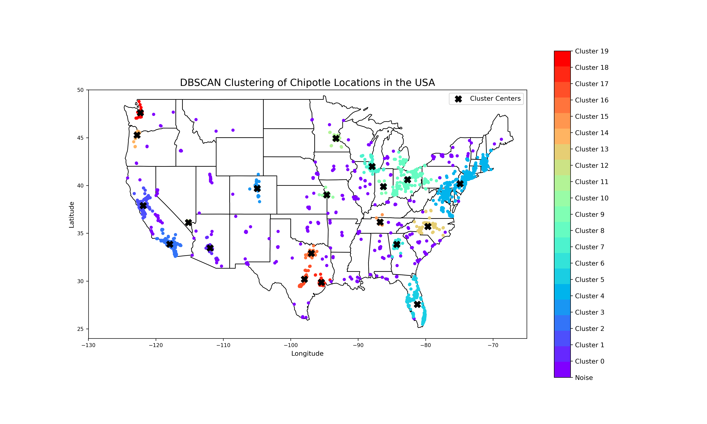
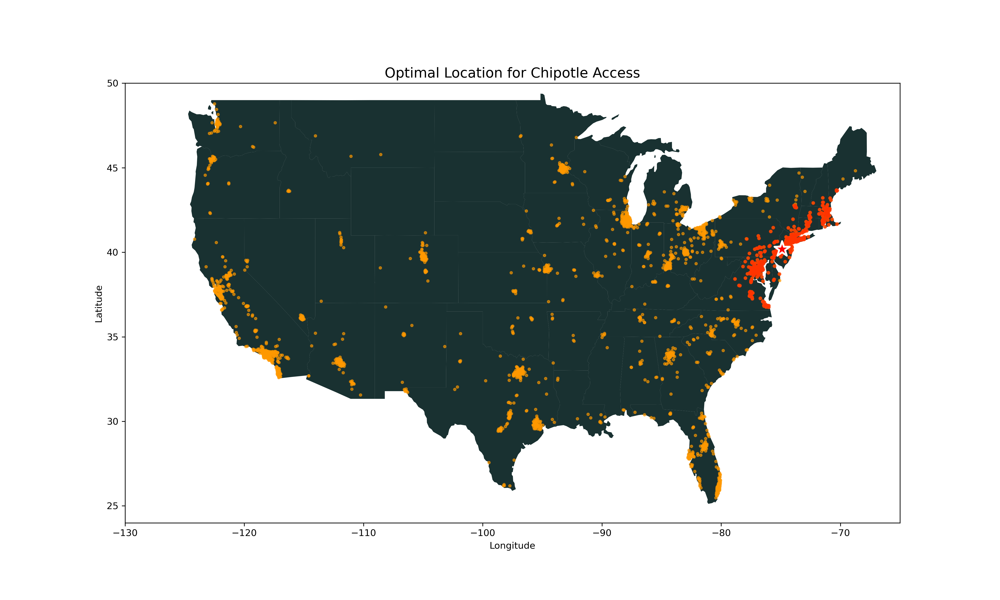
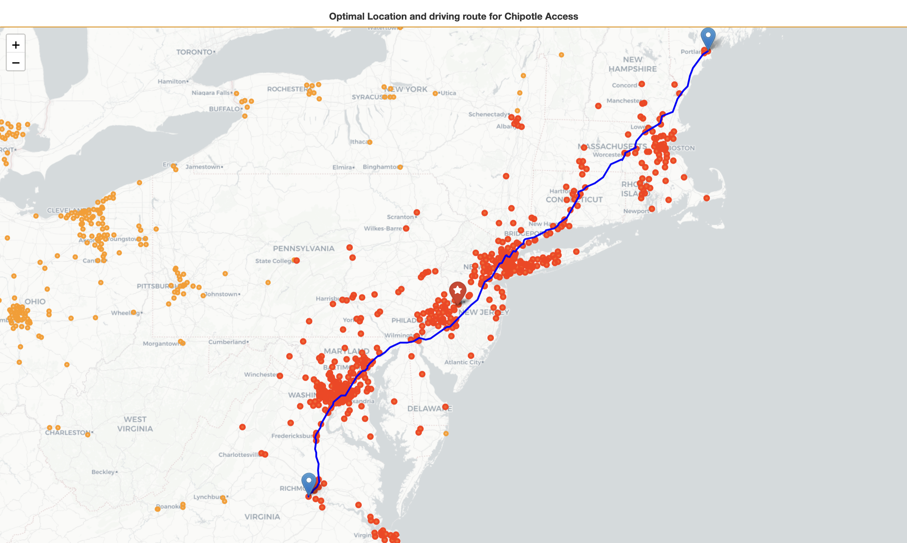

# Chipotle Location Clustering
Let’s say you’re a huge fan of Mexican food—more specifically, a Chipotle fanatic. Every life choice you make revolves around one thing: being as close as possible to your favorite restaurant.

In this project, I use clustering techniques to find the best places to live for a Chipotle-filled life. By analyzing the Chipotle Locations dataset, I identify the most convenient and ideal locations for those who want to enjoy their favorite burritos and bowls with ease.

---

## Dataset
The dataset used for this project contains 2,629 unique values. It includes information about Chipotle store locations, such as their geographical coordinates, state-city and store addresses.

#### Key Features:
- Total values: 2,629
- Data Format: CSV
- Columns: state, location, adress, latitude and longitude.

#### Reference:
Published by: Jeffrey Braun
Chipotle Locations - [Kaggle Dataset](https://www.kaggle.com/datasets/jeffreybraun/chipotle-locations)



---

## Clustering Techniques
**K-means**: A centroid-based algorithm that partitions the data into k clusters
- Silhouette Score: 0.6339
- Number of clusters: 25
- More balanced distribution of cluster sizes
- Does not handle outliers


**Hierarchical**: A connectivity-based algorithm that builds clusters by merging or splitting
- Silhouette Score: 0.6321
- Number of clusters: 30
- Does not handle outliers


**DBSCAN**: A density-based algorithm that identifies clusters as high-density regions
- Silhouette Score: 0.6693 (excluding noise)
- Number of clusters: 20
- Identified 329 noise points, meaning it removes outliers


**Choosen model: DBSCAN**
For this project, the goal was to find a good place to live near Chipotle locations. We don’t need every location to fit perfectly in a cluster, we can have outliers. DBSCAN is a good option for this because it removes outliers and still gives us meaningful clusters. Plus, it has a good silhouette score after ignoring the noise.
```bash
dbscan = DBSCAN(eps=0.9, min_samples=15, metric='euclidean')
```

## Results
**Best cluster**: Cluster number 4 with 601 Chipotle locations
**Best cluster centroid**: Longitude -74.8941, Latitude 40.1820 (Levittown, Pennsylvania)



**Maximum distance within the best cluster**: 932.26 km
**Estimated driving time**: 10 hours 15 mins

Acces the interactive map [here](visualizations/map_driving_route.html)

---
### Installation

1. Clone the repository:

   ```bash
   git clone <repository-url>
   cd <project-directory>
   ```

2. Create the conda environment using the `environment.yml` file:

   ```bash
   conda env create -f environment.yml
   ```

3. Activate the environment:

   ```bash
   conda activate chipotle
   ```

4. Install any additional dependencies (if needed):

   ```bash
   conda install <package-name>
   ```

### Usage
1. Open the [chipotle_clustering_analysis.ipynb](chipotle_clustering_analysis.ipynb) notebook. 
Run all cells to perform the clustering analysis and visualize the results.
<br />

2. Experiment with the number of clusters and other parameters by editing the notebook's cells before running the analysis.
<br />

3. For clarifications or instructions specific to the notebook, refer to the markdown cells and comments within the `chipotle_clustering_analysis.ipynb` notebook.
<br />

4. Extra: To run the last part of the notebook you'll need a [Google API Key](https://developers.google.com/maps/documentation/directions/start). Store you Key in a JSON file called `API_key.json` or you modify the code to use the key directly within the notebook by inserting the key as a string in the relevant cell.

***
### Contributors
[Jessica Rojas Alvarado](https://github.com/jessrojasal) | 2025
